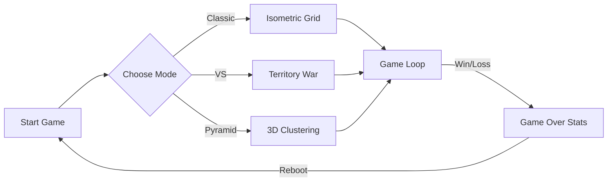

# WakaWaka 2.0 🕹️

> A Cyber-Arcade Isometric Puzzle Game by **[SREdesigns.com](https://sredesigns.com)**.

  

**WakaWaka** is a modern reimagining of classic arcade mechanics, built entirely with web technologies. Control **WakaBert** in a neon-soaked isometric world, claiming territory by painting tiles while outsmarting AI ghosts and navigating treacherous hazards.

## 🎮 Play Now

**[Play the Game](https://srephoto.github.io/WakaWaka/)**

## 📂 Documentation

- **[Product Requirements (PRD)](./PRD.md)**: Detailed breakdown of game mechanics, modes, and systems.
- **[MVP Scope](./MVP.md)**: Definition of the Minimum Viable Product and Architecture Diagrams.
- **[Changelog](./CHANGELOG.md)**: History of updates and versions.

## ✨ Key Features

- **Isometric 3D Engine**: Built with pure CSS transformations (no Canvas/WebGL required).
- **Multiple Modes**:
  - **Classic**: Survive and advance through infinite levels.
  - **VS Mode**: Battle an AI Rival for board dominance.
  - **Pyramid**: Navigate a multi-layered 3D structure.
- **Reactive Audio**: Synthesized sound effects powered by the Web Audio API.

## 🛠️ Tech Stack

- **Framework**: React 18 + TypeScript
- **Build Tool**: Vite
- **Styling**: CSS Modules + Variables
- **Deployment**: GitHub Pages

## 🚀 Getting Started

```bash
# Install dependencies
npm install

# Start development server
npm run dev

# Build for production
npm run build
```

## 🧜‍♀️ System Flow



---
*Created by SREdesigns.com - Building the future of web interactive experiences.*
